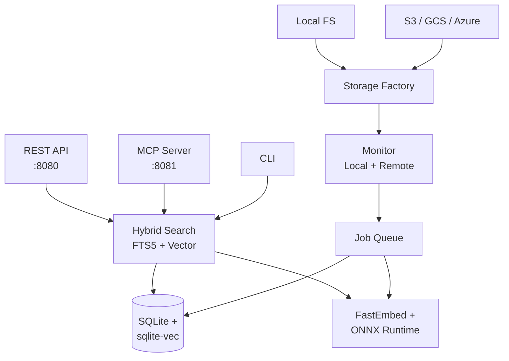

# Architecture Overview

StrataFS is a modular, multi-storage semantic indexing layer. The architecture sits between your storage backends and your AI consumers — it does not replace your filesystem, it augments it.

## High-level view



The flow is one-directional: storage → monitor → queue → parse/chunk → embed → database → search → APIs.

## Packages

| Package | Responsibility |
| --- | --- |
| `cmd/stratafs` | CLI entry point. Wires config, storage factory, watchers, queue workers, API, and MCP server. |
| `pkg/config` | Defaults, environment overrides, source helpers. |
| `pkg/storage`, `pkg/filesystem` | Storage factory + filesystem abstraction. Local, S3, GCS, Azure. |
| `pkg/monitor` | Local file watcher (fsnotify) and remote scanner. |
| `pkg/parsers`, `pkg/chunking` | Parser registry and chunking strategies. |
| `pkg/queue` | SQLite-backed job queue and StrataFS processor. |
| `pkg/embeddings` | FastEmbed + ONNX Runtime integration. |
| `pkg/database` | Schema, compression, maintenance, chunk/file helpers. |
| `pkg/search` | Hybrid search (FTS + vector) and vector index management. |
| `pkg/api`, `pkg/protocol` | REST API and MCP server. |
| `pkg/fsbridge` | FUSE / WinFsp filesystem export. |

Supporting utilities live in `internal/utils`. Deployment tooling (Docker, installers, packages) lives at the top level.

## Storage layer

The **storage factory** is a strategy pattern: backends implement a common `filesystem.FileSystem` interface, and the factory picks one by source `type`. Adding a new backend is a matter of:

1. Implementing `filesystem.FileSystem`.
2. Adding a factory branch.
3. Defining the credential schema.

Remote backends fetch files to `local_cache_dir`, parse them, then evict. Local backends read in place.

## Processing pipeline

```
File event → Watcher → Queue → Parser → Streaming Chunker → Embedder → Update Manager → Search Index
                                                                              ↓
                                                                     Soft-delete old chunks
```

- The **watcher** turns filesystem events (real-time, local) or scan deltas (polled, remote) into queue jobs.
- The **queue** persists jobs in SQLite. It survives restarts and supports priority and retry-with-backoff.
- The **parser registry** picks an extractor by extension.
- The **streaming chunker** processes large files without loading them into memory.
- The **embedder** runs the ONNX model.
- The **update manager** atomically swaps in new chunks while soft-deleting the old ones.

## AI/ML layer

- **Engine**: FastEmbed-go with ONNX Runtime.
- **Models**: BGE family by default (Base 768d or Small 384d). Other ONNX-compatible models work with a config change.
- **Performance**: model is loaded once, embeddings are batched, results cached in memory.

## Search engine

A single SQL query combines:

- **FTS5 BM25** ranking via SQLite's full-text extension.
- **Cosine similarity** via [`sqlite-vec`](https://github.com/asg017/sqlite-vec).
- **Metadata scoring** (recency, filename match, file-type bonus).

Per-source database isolation means each query runs against a single SQLite file. No central index, no shared bottleneck. See [Database](database.md) for the schema and [Performance](performance.md) for measured latencies.

## API layer

- **REST API** (port 8080): general-purpose. OpenAPI spec at `/openapi.json`.
- **MCP server** (port 8081): tuned for AI agents. Returns chunks already shaped for context windows.

Both servers share state — anything indexed through one is visible to the other.

## Design principles

**Read-only source integrity.** StrataFS never modifies source files. All state lives in `.stratafs/` directories owned by StrataFS.

**Per-source isolation.** Add or remove a source by editing one file. Backups are per-source. A corrupted source can't take the others down.

**Streaming everywhere.** Files are processed in chunks, not loaded entirely. Memory footprint is constant regardless of file size.

**Fault tolerance.** Jobs retry with backoff. Failed files don't block the queue. State recovers from disk after restart.

## Configuration

JSON config at `~/.stratafs/config.json`. Environment variables override at runtime. `ValidateSource` checks per-source basics (path exists for local, bucket / container set for cloud); broken credentials, missing model weights, or port conflicts surface the first time the affected subsystem starts. See [Configuration](../user-guide/configuration.md).

## Security model

StrataFS is **local-trust**. The default deployment assumes the caller is trusted. Production deployments place a reverse proxy in front for auth — see the [Production Checklist](../deployment/production-checklist.md).

- Embeddings are generated locally. No data is sent to external AI services.
- Each source's database is isolated from the others.
- Cloud credentials live in config; mount them via a secrets manager.

## Extending

| Want to add… | See |
| --- | --- |
| A new storage backend | [Contributing → Development](../contributing/development.md) |
| A new file parser | [Contributing → Development](../contributing/development.md) |
| A new chunking strategy | [Contributing → Development](../contributing/development.md) |
| A new API endpoint | [Contributing → Development](../contributing/development.md) |
| A new embedding model | Drop an ONNX-compatible model into the cache; reference it in `embedding.model`. |
